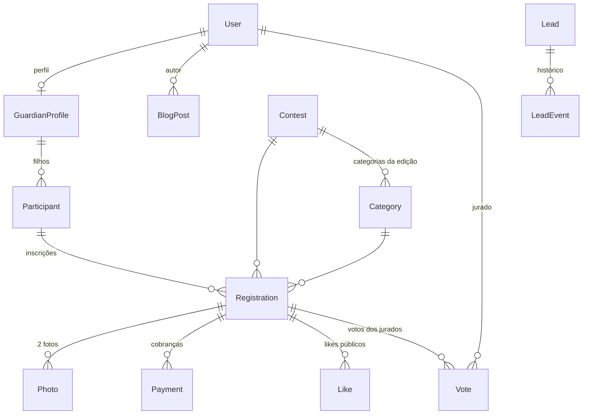

# 03 — Modelo de Dados

Fonte de verdade: `prisma/schema.prisma`. Este documento explica as decisões.

## Diagrama (principais relações)



## Decisões de modelagem

| Decisão | Motivo |
| --- | --- |
| `Participant` separado de `Registration` | A criança é cadastrada uma vez e pode competir em várias edições. A inscrição (`Registration`) é o vínculo criança × edição × categoria. |
| `Category` pertence a `Contest` | Faixas etárias podem mudar entre edições. |
| Idade em **meses** (`minAgeMonths`/`maxAgeMonths`) | As categorias Bebê/Mirim são sub-anuais. |
| `registrationFeeCents` / `amountCents` | Dinheiro sempre em centavos (Int), sem float. |
| `likesCount` desnormalizado em `Registration` | Leitura barata na galeria; fonte de verdade é a tabela `likes` (unique por fingerprint). |
| `Payment` 1:N com `Registration` | Uma inscrição pode ter mais de uma tentativa de cobrança (ex.: boleto vencido → novo PIX). |
| `WebhookEvent` com `externalId` único | Idempotência e auditoria dos webhooks do Asaas. |
| `Lead` cobre só o pré-conta | O funil pós-conta é **derivado** de `Registration` (fotos/checkout/pagamento) — evita duplicar estado. Lead captura abandono antes do cadastro, identificado por CPF ou e-mail. |
| `Vote` com `round` | Rodada 1 elege os 80 semifinalistas, rodada 2 os 10 vencedores. |
| `Partner.type` (`MASTER`/`MEDIA`/`SPONSOR`) | Uma tabela para parceiros master, veículos de comunicação e patrocinadores. |
| `BlogPost.publishedAt` opcional | Permite rascunho/agendamento; leitura pública só considera posts com data no passado. |

## Máquinas de estado

### Registration.status

```
DRAFT → PENDING_PAYMENT → PAID → UNDER_REVIEW → APPROVED | REJECTED
APPROVED → SEMIFINALIST → WINNER
```

Admin pode sobrescrever manualmente `Registration.status` em `/admin/participantes`
para corrigir operação, publicação ou resultado sem criar novos status.

### Payment.status (espelha Asaas)

```
PENDING → CONFIRMED → RECEIVED
PENDING → OVERDUE | CANCELED
CONFIRMED/RECEIVED → REFUNDED
```

### Contest.status

```
DRAFT → REGISTRATION_OPEN → REGISTRATION_CLOSED → JUDGING → RESULTS_PUBLISHED → ARCHIVED
```

### Lead.stage (pré-conta apenas)

```
NEW → CONVERTED   (conta criada — ensureGuardian chama convertLead)
NEW → LOST        (descarte manual pelo admin)
```

### Funil de vendas do CRM (derivado, não persistido)

```
Lead NEW (pré-conta)
  → PENDING_PHOTOS      (Registration DRAFT, < 2 fotos)
  → READY_FOR_CHECKOUT  (Registration DRAFT, 2 fotos)
  → PAYMENT_PENDING     (Registration PENDING_PAYMENT)
  → PAYMENT_CONFIRMED   (Registration PAID em diante)
```

Fonte: `getEnrollmentFunnel()` em `registrations` — nenhuma etapa duplicada
em tabela própria.
