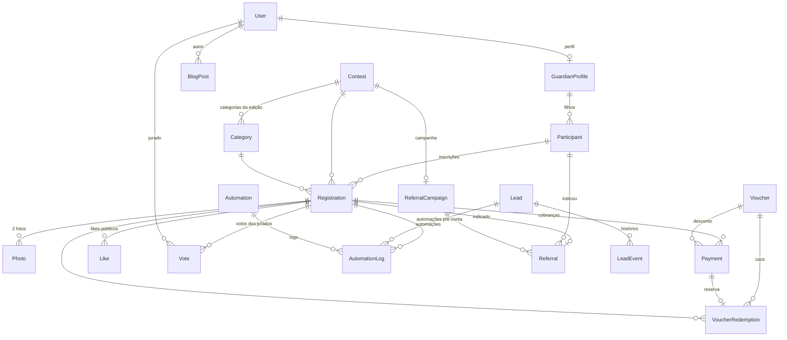

# 03 — Modelo de Dados

Fonte de verdade: `prisma/schema.prisma`. Este documento explica as decisões.

## Diagrama (principais relações)


```mermaid
erDiagram
    User ||--o| GuardianProfile : "perfil"
    User ||--o{ BlogPost : "autor"
    GuardianProfile ||--o{ Participant : "filhos"
    Participant ||--o{ Registration : "inscrições"
    Contest ||--o{ Registration : ""
    Contest ||--o{ Category : "categorias da edição"
    Category ||--o{ Registration : ""
    Registration ||--o{ Photo : "2 fotos"
    Registration ||--o{ Payment : "cobranças"
    Voucher ||--o{ VoucherRedemption : "usos"
    Voucher ||--o{ Payment : "desconto"
    Payment ||--o| VoucherRedemption : "reserva"
    Registration ||--o{ VoucherRedemption : ""
    Registration ||--o{ Like : "likes públicos"
    Registration ||--o{ Vote : "votos dos jurados"
    Registration ||--o{ AutomationLog : "automações"
    Registration ||--o| Referral : "indicado"
    Participant ||--o{ Referral : "indicou"
    Contest ||--o| ReferralCampaign : "campanha"
    ReferralCampaign ||--o{ Referral : ""
    Lead ||--o{ AutomationLog : "automações pré-conta"
    Automation ||--o{ AutomationLog : "logs"
    User ||--o{ Vote : "jurado"
    Lead ||--o{ LeadEvent : "histórico"
```

## Decisões de modelagem

| Decisão | Motivo |
| --- | --- |
| `Participant` separado de `Registration` | A criança é cadastrada uma vez e pode competir em várias edições. A inscrição (`Registration`) é o vínculo criança × edição × categoria. |
| `Category` pertence a `Contest` | Faixas etárias podem mudar entre edições. |
| Idade em **meses** (`minAgeMonths`/`maxAgeMonths`) | As categorias Bebê/Mirim são sub-anuais. |
| `registrationFeeCents` / `amountCents` | Dinheiro sempre em centavos (Int), sem float. |
| `likesCount` desnormalizado em `Registration` | Leitura barata na galeria; fonte de verdade é a tabela `likes` (unique por fingerprint). |
| `Payment` 1:N com `Registration` | Uma inscrição pode ter mais de uma tentativa de cobrança (ex.: boleto vencido → novo PIX). |
| `Voucher` + `VoucherRedemption` | Desconto fixo no checkout; estoque = RESERVED+CONFIRMED; FREE quando líquido = 0. |
| `Payment.originalAmountCents` / `discountCents` / `voucherCode` | Snapshots do preço cheio e do cupom no momento da cobrança. |
| `PaymentMethod.FREE` | Inscrição gratuita (voucher zerou a taxa) — sem cobrança Asaas. |
| `WebhookEvent` com `externalId` único | Idempotência e auditoria dos webhooks do Asaas. |
| `AutomationLog` genérico | Auditoria e idempotência de disparos automáticos (WhatsApp/e-mail futuros), sem duplicar estado de funil. Usa `subjectType` (`LEAD` \| `REGISTRATION`) + `subjectId` para unicidade por automação. |
| `Automation` com `config` JSON tipado | Múltiplas automações por canal; config define gatilho (`SCHEDULED`/`EVENT`), etapa do funil, delay e template. |
| `Lead` cobre só o pré-conta | O funil pós-conta é **derivado** de `Registration` (fotos/checkout/pagamento) — evita duplicar estado. Lead captura abandono antes do cadastro, identificado por CPF ou e-mail. |
| `Vote` com `round` | Rodada 1 elege os 80 semifinalistas, rodada 2 os 10 vencedores. |
| `Registration.deletedAt` (soft delete) | Cancelamento pelo responsável antes do pagamento confirmado. Mantém histórico/auditoria; todas as listagens filtram `deletedAt: null`. |
| `Participant.referralCode` | Código único por criança; link `/inscricao?indicacao=`; módulo `referrals`. |
| `ReferralCampaign` por `Contest` | Uma campanha por edição (v1): prêmio em curtidas, período, habilitação. |
| `Referral` | Vínculo indicador → inscrição indicada; prêmio em `rewardGrantedAt`. |
| `GuardianProfile.referralCode` | Legado das automações WhatsApp; indicação operacional usa código do participante. |
| `BlogPost.publishedAt` opcional | Permite rascunho/agendamento; leitura pública só considera posts com data no passado. |

## Máquinas de estado

### Registration.status

```
DRAFT → PENDING_PAYMENT → PAID → UNDER_REVIEW → APPROVED | REJECTED
APPROVED → SEMIFINALIST → WINNER
```

Admin pode sobrescrever manualmente `Registration.status` em `/admin/participantes`
para corrigir operação, publicação ou resultado sem criar novos status.

### Payment.status (espelha Asaas)

```
PENDING → CONFIRMED → RECEIVED
PENDING → OVERDUE | CANCELED
CONFIRMED/RECEIVED → REFUNDED
```

`FREE` nasce já `RECEIVED` (sem Asaas).

### VoucherRedemption.status

```
RESERVED → CONFIRMED   (pagamento confirmado)
RESERVED → RELEASED    (cobrança vencida/cancelada ou nova tentativa)
CONFIRMED → RELEASED   (reembolso)
RELEASED → CONFIRMED   (pagamento tardio de cobrança cuja reserva foi liberada)
```

### Contest.status

```
DRAFT → REGISTRATION_OPEN → REGISTRATION_CLOSED → JUDGING → RESULTS_PUBLISHED → ARCHIVED
```

### Lead.stage (pré-conta apenas)

```
NEW → CONVERTED   (conta criada — ensureGuardian chama convertLead)
NEW → LOST        (descarte manual pelo admin)
```

### Funil de vendas do CRM (derivado, não persistido)

```
Lead NEW (pré-conta)
  → PENDING_PHOTOS      (Registration DRAFT, < 2 fotos)
  → READY_FOR_CHECKOUT  (Registration DRAFT, 2 fotos)
  → PAYMENT_PENDING     (Registration PENDING_PAYMENT)
  → PAYMENT_CONFIRMED   (Registration PAID em diante)
```

Fonte: `getEnrollmentFunnel()` em `registrations` — nenhuma etapa duplicada
em tabela própria.
